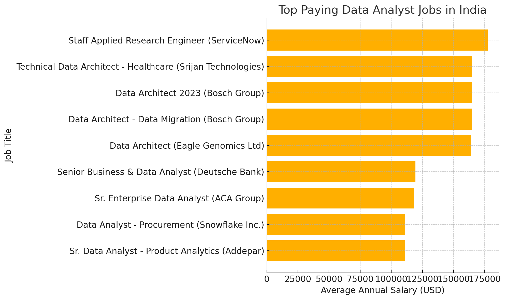
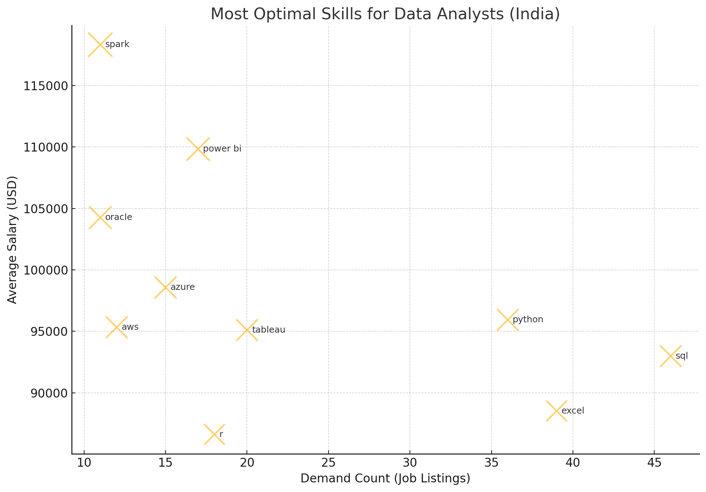

# 📘 Introduction
This SQL project analyzes the Data Analyst job market to uncover trends in salary, skill demand, and optimal career growth.
Using real job posting data (customized for India-based roles), it explores which skills pay the most, which are most in-demand, and which offer the best balance between the two — helping identify the most valuable skillset for Data Analysts today.

SQL Queries? You can look up at them at [project_sql folder](/project_sql/)

# 🧠 Background

Driven by the goal to **decode the Data Analyst job market**, this project focuses on identifying the **top-paying** and **most in-demand skills** using real job posting data.
It was built to streamline insights for aspiring analysts — helping them focus on skills that actually lead to **better opportunities and higher salaries**.

The dataset comes from [Luke Barousse’s SQL Course](https://lukebarousse.com/sql), featuring thousands of job postings with detailed information on **titles, salaries, locations, and required skills**.

Here’s the clean, polished version of that section for your README 👇

###  The Questions I Wanted to Answer Through SQL

1. What are the **top-paying Data Analyst jobs**?
2. What **skills are required** for these top-paying jobs?
3. Which **skills are most in demand** for Data Analysts?
4. Which skills are **associated with higher salaries**?
5. What are the **most optimal skills to learn** — balancing both high demand and high pay?

# 🛠️ Tools I Used

For this deep dive into the Data Analyst job market, I utilized several key tools:

* **SQL** – The backbone of this analysis, used to query the database and extract actionable insights.
* **PostgreSQL** – The chosen database management system, ideal for handling and analyzing large-scale job posting data.
* **Visual Studio Code** – My go-to environment for writing, managing, and executing SQL queries efficiently.
* **Git & GitHub** – Essential for version control, collaboration, and sharing project progress through clean, trackable commits.

## 📊 The Analysis

This project analyzes the **Data Analyst job market in India** through five progressive SQL queries, each designed to uncover a different layer of insight — from identifying top-paying jobs to revealing the most optimal skills for career growth.

All query outputs are stored in the [/Output/](/Output/) folder for further reference and visualization.

### 🧩 Breakdown by Query

1. **Top-Paying Data Analyst Jobs**
   → Queried job postings filtered by *Data Analyst* roles in India, sorted by average annual salary to find the **10 highest-paying positions** and their respective companies.
<pre>
<code>
SELECT 
    job_id,
    job_title,
    name as company_name,
    job_schedule_type,
    salary_year_avg,
    job_location,
    job_posted_date
FROM
    job_postings_fact

left JOIN
    company_dim USING (company_id)
WHERE
    job_title_short ILIKE 'data analyst' and 
    job_location ilike'%India' AND
    salary_year_avg is NOT NULL
ORDER BY
    salary_year_avg DESC
LIMIT 10
</code>
</pre>

*Figure: Top-paying Data Analyst roles in India, showing average annual salaries (USD) across major companies and cities.*

2. **Skills for Top-Paying Jobs**
   → Joined job postings with the skills dataset to identify **which skills appear most often** among those top-paying roles.
   <pre>
   <code>
    With top_paying_job as (
    SELECT 
        job_id,
        job_title,
        name as company_name,
        salary_year_avg,
        job_location
    FROM
        job_postings_fact

    left JOIN
        company_dim USING (company_id)
    WHERE
        job_title_short ILIKE 'data analyst' and    
        job_location ilike'%India' AND
        salary_year_avg is NOT NULL
    ORDER BY
        salary_year_avg DESC
    LIMIT 10
    )

    select 
        top_paying_job.*,
        skills
    from top_paying_job
    INNER JOIN skills_job_dim USING (job_id)
    inner JOIN skills_dim using (skill_id)

    ORDER BY
        salary_year_avg DESC
   </code>
   </pre>

    

    ## 📊 Top Skills Mentioned (by Frequency)

    | Rank | Skill                               | Mentions | Insight                                            |
    | ---- | ----------------------------------- | -------- | -------------------------------------------------- |
    | 1️⃣  | **SQL**                             | ~7       | Foundation for every analyst/architect role.       |
    | 2️⃣  | **Python**                          | ~6       | Used for data cleaning, automation, and analytics. |
    | 3️⃣  | **Power BI**                        | ~4       | Common visualization + reporting skill.            |
    | 4️⃣  | **Azure**                           | ~4       | Cloud environment for modern data pipelines.       |
    | 5️⃣  | **AWS**                             | ~3       | Secondary but strong cloud skill.                  |
    | 6️⃣  | **Spark**                           | ~3       | Big data processing, key for high-salary roles.    |
    | 7️⃣  | **Oracle**                          | ~3       | Legacy + migration-heavy enterprise systems.       |
    | 8️⃣  | **Databricks / Snowflake / Hadoop** | ~2       | Modern data infrastructure — boosts pay.           |
    | 9️⃣  | **Pandas**                          | ~2       | Core Python library for data manipulation.         |
    | 🔟   | **R / Excel**                       | ~2       | Still valuable for analytics and reporting.        |

    ---

    > **Insight:**
    > Most high-paying analyst roles blend **data engineering, cloud, and visualization skills** — SQL and Python remain non-negotiable foundations, while tools like Power BI and Spark differentiate advanced professionals.

3. **Most In-Demand Skills**
   → Counted how frequently each skill appeared across *all* Data Analyst job postings in India to find the **top 5 most requested skills** in the market.
    <pre><code>
    SELECT 
    skills,
    count(skills_job_dim.job_id) as demand_count
    FROM 
        job_postings_fact
    INNER JOIN
        skills_job_dim USING (job_id)
    INNER JOIN
        skills_dim USING (skill_id)

    WHERE
        job_title_short ILIKE '%data analyst%' AND
        job_location ILIKE '%india'
    GROUP BY
        skills
    ORDER BY
        demand_count DESC
    LIMIT 5
    </code></pre>

---
    ## 🧾 Most In-Demand Skills for Data Analysts (India)

    | Rank | Skill        | Demand Count |
    | ---- | ------------ | ------------ |
    | 1️⃣  | **SQL**      | 3,145        |
    | 2️⃣  | **Python**   | 2,178        |
    | 3️⃣  | **Excel**    | 1,988        |
    | 4️⃣  | **Tableau**  | 1,628        |
    | 5️⃣  | **Power BI** | 1,212        |

    ---

    > **Insight:**
    > The demand clearly centers around **core analytical tools** — SQL and Python dominate every Data Analyst job posting, while Excel and visualization platforms like Tableau and Power BI remain essential for business-facing analytics.
---

4. **Top Skills by Salary**
   → Calculated the **average salary per skill**, showing which technical abilities are linked with the highest pay, regardless of location.

## 💰 Insights — Top Paying Skills for Data Analysts (India-Filtered)

Although the data was filtered for job postings mentioning *India*, the salaries are still in **USD**, reflecting **global roles accessible to India-based professionals** (including remote or hybrid positions).
These results reveal which skills command the **highest global pay** for Data Analysts working *in or from* India.

---

### 🧩 Skill Category Insights

| Category                              | Example Skills                                       | Key Insight                                                                   |
| ------------------------------------- | ---------------------------------------------------- | ----------------------------------------------------------------------------- |
| 🧠 **Data Engineering & Big Data**    | Databricks, Spark, Airflow, Hadoop, Scala, Snowflake | Highest-paying domain — powering data pipelines, ETL, and scalable analytics. |
| 🐍 **Data Processing (Python Stack)** | Pandas, PySpark                                      | Strong demand for Python-driven data wrangling and automation.                |
| ☁️ **Cloud Platforms**                | AWS, Azure, BigQuery, Redshift                       | Cloud proficiency pushes salary premium across all analyst roles.             |
| 📊 **BI & Visualization**             | Power BI, Looker, Tableau                            | Still core to business communication — solid pay with lower entry barrier.    |
| 🏢 **Enterprise Systems**             | SAP, Oracle, Unix                                    | Legacy tech remains lucrative in large corporations and finance.              |

---

### 💰 Key Takeaways

* **Databricks, Spark, and Airflow** dominate top-tier pay — they form the *modern data engineering core.*
* **Pandas + Python** remain universal — every analyst still needs them for data handling.
* **Visualization tools** like *Power BI* are still crucial for business-facing roles, maintaining strong salaries.
* **Cloud + automation experience** consistently lead to *global-level compensation* even for India-based analysts.
* The real money lies in the **hybrid zone** — analysts who understand both *business insight* and *data infrastructure.*

---

### 🎯 Summary

> The transition from **“Data Analyst”** to **“Data Engineer”** or **“Analytics Engineer”** skillsets — combining **SQL, Python, BI, Cloud, and Big Data tools** — is where India-based professionals unlock the **highest global salaries**.

---

5. **Most Optimal Skills (High Demand + High Pay)**
   → Combined skill demand and salary data, filtered out noise (`HAVING COUNT(job_id) > 10`), and ranked skills by both metrics to reveal the **most valuable skills** for analysts to learn.

   <pre><code>
   SELECT 
    s.skill_id,
    s.skills,
    COUNT(sj.job_id) AS demand_count,
    ROUND(AVG(j.salary_year_avg), 2) AS avg_salary
    FROM 
        job_postings_fact AS j
    INNER JOIN
        skills_job_dim AS sj ON j.job_id = sj.job_id
    INNER JOIN
        skills_dim AS s ON sj.skill_id = s.skill_id
    WHERE
        j.job_title_short ILIKE 'Data Analyst'
        AND j.salary_year_avg IS NOT NULL
        AND job_location ILIKe '%india'
    GROUP BY 
        s.skill_id, s.skills
    HAVING 
        COUNT(sj.job_id) > 10
    ORDER BY 
        avg_salary DESC,
        demand_count DESC
    </code></pre>

*Figure: Visualization of skills that balance high demand and high salary. Top-right bubbles (like Spark, Power BI, and Python) represent the most optimal skill set for Data Analysts in India.*
* **Spark**, **Power BI**, and **Python** stand out as the most optimal skills, offering both high pay and strong market demand.
* **SQL** and **Excel** dominate in demand but fall slightly behind in salary, showing their necessity yet saturation in the market.
* **Azure** and **AWS** highlight the rising importance of cloud proficiency in analytics roles.
* **Oracle** and **Tableau** bridge enterprise data systems with visualization, maintaining balanced relevance.
* The overall trend shows that analysts skilled in **data engineering + BI tools** earn higher salaries while retaining broad demand.

* **Spark**, **Power BI**, and **Python** are top performers, offering strong balance between high demand and high pay.
* **SQL** and **Excel** remain core skills with broad demand but slightly lower salary growth.
* **Azure** and **AWS** emphasize the value of cloud expertise in analytics careers.
* **Oracle** and **Tableau** link enterprise data management with visualization, keeping them consistently valuable.
* Analysts combining **data engineering, BI, and cloud skills** achieve the highest market value overall.

# What I Learned
* Strengthened my ability to **write complex SQL queries** using `JOIN`, `CTE`, `HAVING`, and aggregate functions.
* Learned how to **combine datasets** logically to uncover real-world insights, not just retrieve data.
* Understood how to **clean and filter data effectively**, removing outliers and low-frequency noise (`HAVING COUNT > 10`).
* Gained a clear view of how **skills, salary, and demand interact** in the data analytics job market.
* Improved my understanding of **data storytelling** — turning raw query results into meaningful visual and written insights.
* Practiced a professional workflow with **GitHub, VS Code, and PostgreSQL**, mirroring real data projects.
* Realized how critical **data validation and interpretation** are — SQL alone doesn’t create insight, reasoning does.

# Conclusion
### 💡 Insights-Based Conclusion

This project provided an in-depth, data-driven look into the **Data Analyst job market in India**, revealing how specific skills influence both pay and demand. The findings showed that while **SQL and Python** form the essential base for all analysts, professionals skilled in **Power BI, Spark, and cloud tools** like **Azure** and **AWS** gain a clear competitive edge. These tools not only elevate salaries but also align with the industry’s shift toward data engineering and scalable analytics. The data emphasized that the most valuable analysts today are those who can seamlessly blend **data processing, visualization, and cloud integration** — bridging technical depth with business insight.

### 🔚 Closing Thoughts

Working through this project strengthened both my **SQL expertise** and my ability to **translate raw data into meaningful insights**. It taught me that in analytics, knowing how to query isn’t enough — understanding *what the data is saying* matters more. The overall takeaway is clear: continuous learning across tools, from **data pipelines to visualization**, is the key to long-term growth. The future of data analytics belongs to those who think like **engineers, storytellers, and strategists** — all at once.

